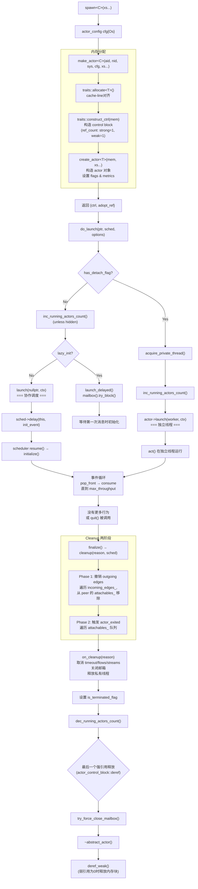
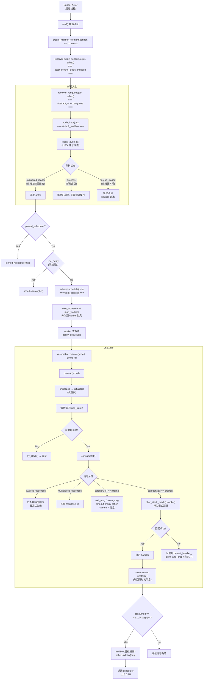
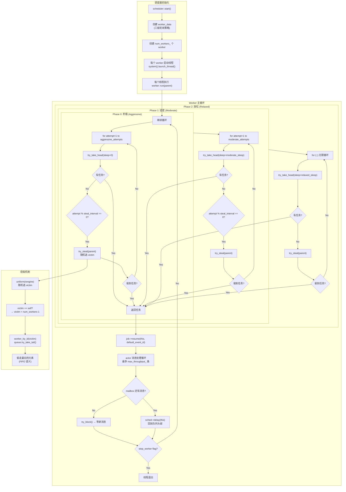

# CAF Actor Model & Scheduling 深度分析

> 基于 `/root/actor-framework/libcaf_core/` 源代码分析
> 分析日期: 2000-01-01

---

## 目录

1. [Actor 基础架构](#1-actor-基础架构)
2. [Actor System](#2-actor-system)
3. [调度机制](#3-调度机制)
4. [Actor 类型](#4-actor-类型)
5. [关键流程图](#5-关键流程图-mermaid)

---

## 1. Actor 基础架构

### 1.1 三层句柄体系

CAF 使用三层句柄体系来管理 actor 的生命周期和身份:

```
actor (强引用句柄)
  └── strong_actor_ptr = intrusive_ptr<actor_control_block>
      └── 成员: ptr_ (strong_actor_ptr)

actor_addr (弱引用地址)
  └── weak_actor_ptr = weak_intrusive_ptr<actor_control_block>
      └── 成员: ptr_ (weak_actor_ptr)

actor_control_block (控制块)
  └── 内嵌于 actor 对象的内存块头部
```

**`actor`** (`libcaf_core/caf/actor.hpp:31`):
- 强引用句柄，拥有 `has_weak_ptr_semantics = false`
- 包装 `strong_actor_ptr` (`intrusive_ptr<actor_control_block>`)
- 提供 `id()`、`node()`、`home_system()`、`address()` 等访问方法
- 通过 `operator->()` 解引用得到 `abstract_actor*` (line 118-121)
- 可隐式构造自动态类型 actor 指针 (line 59-63)

```cpp
// file: libcaf_core/caf/actor.hpp, line 169
strong_actor_ptr ptr_;
```

**`actor_addr`** (`libcaf_core/caf/actor_addr.hpp:24`):
- 弱引用地址，拥有 `has_weak_ptr_semantics = true`
- 包装 `weak_actor_ptr` (`weak_intrusive_ptr<actor_control_block>`)
- 提供 `lock()` 方法尝试升级为强引用 (line 130-132)
- 用于打破循环引用（如双向链接）

```cpp
// file: libcaf_core/caf/actor_addr.hpp, line 137
weak_actor_ptr ptr_;
```

**`actor_control_block`** (`libcaf_core/caf/actor_control_block.hpp:50`):
- 所有 actor 对象的内存布局起点，与 actor 数据在同一 cache-line 对齐的内存块中
- 内存布局 (line 33-41):

```
+-----------------+------------------+
|  control block  |  actor data (T)  |
+-----------------+------------------+
| strong refs     | mailbox          |
| weak refs       | ...              |
| actor ID        |                  |
| node ID         |                  |
| ...             |                  |
+-----------------+------------------+
```

- 成员 (line 168-181):
  - `ref_count_` — `control_block_ref_count` 强/弱引用计数
  - `aid_` — actor ID (uint64_t)
  - `nid_` — node ID
  - `system_` — 所属 `actor_system*`
  - `iface_` — 类型化消息接口指针

### 1.2 继承链

```
abstract_actor  (libcaf_core/caf/abstract_actor.hpp:56)
  └── abstract_ref_counted   (引用计数基类)
  ├── flags_     (std::atomic<int> — 32位标志位)
  ├── mtx_       (std::mutex)
  ├── cv_        (std::condition_variable)
  ├── fail_state_ (error)
  ├── attachables_ (intrusive::lifo_uptr_queue<attachable>)
  └── incoming_edges_ (weak_actor_ptr → size_t 映射)

  └── local_actor  (libcaf_core/caf/local_actor.hpp:43)
      ├── context_           (scheduler*)
      ├── current_element_   (mailbox_element*)
      ├── initial_behavior_fac_
      └── metrics_           (telemetry::actor_metrics)

      ├── abstract_scheduled_actor  (libcaf_core/caf/abstract_scheduled_actor.hpp:17)
      │   └── non_blocking_actor_base
      │   ├── last_request_id_ (message_id)
      │   ├── new_request_id() / new_u64_id()
      │   └── 纯虚接口: add_awaited_response_handler, run_actions 等
      │
      │   └── scheduled_actor  (libcaf_core/caf/scheduled_actor.hpp:74)
      │       └── resumable  (协程调度接口)
      │       └── flow::coordinator  (流式编程接口)
      │       ├── mailbox_ (abstract_mailbox*)
      │       ├── bhvr_stack_ (detail::behavior_stack)
      │       ├── awaited_responses_
      │       ├── multiplexed_responses_
      │       ├── timeout_state_
      │       ├── actions_ / released_ / watched_disposables_
      │       ├── stream_sources_ / stream_subs_ / stream_bridges_
      │       └── stash_ (跳过消息暂存栈)
      │
      │       └── event_based_actor  (libcaf_core/caf/event_based_actor.hpp:29)
      │           └── dynamically_typed_actor_base
      │           ├── become() / unbecome() / make_behavior()
      │           └── mail() — 构造消息
      │
      └── abstract_blocking_actor  (libcaf_core/caf/abstract_blocking_actor.hpp:16)
          └── last_request_id_
          └── receive_impl() 纯虚

          └── blocking_actor  (libcaf_core/caf/blocking_actor.hpp:46)
              └── abstract_blocking_actor
              └── dynamically_typed_actor_base
              └── blocking_actor_base
              ├── mailbox_ (abstract_mailbox_ptr)
              ├── stash_
              ├── act() — 用户定义的阻塞行为
              ├── receive() / receive_while() / do_receive()
              └── await_data() / dequeue()
```

### 1.3 生命周期管理 (Ref Counting)

**控制块引用计数** (`libcaf_core/caf/actor_control_block.cpp:32-103`):

`actor_control_block::deref()` 实现了严谨的 CAS 循环来管理生命周期:

```
deref() 被调用
  │
  ├── count > 1: CAS(count, count-1) → return
  │
  └── count == 1: (最后一个强引用释放)
      ├── 调用 try_force_close_mailbox() 关闭邮箱
      │   ├── 成功: 调用 on_unreachable() → cleanup()
      │   └── 失败: 有另一个线程插入了新消息, 重试
      ├── 再次进入 CAS 循环:
      │   ├── count > 1: 递减后 return (其他线程增加了引用)
      │   └── count == 1: 调用析构函数, 然后 deref_weak()
      └── 最多重试100次, 否则 panic
```

关键细节:
- Actor 初始强引用计数为 1，弱引用计数也为 1 (`actor_control_block.hpp:43-46`)
- 弱引用计数在强引用降到 0 后递减
- Actor 对象析构时（最后一次强引用释放），调用 `~abstract_actor()` 然后 `deref_weak()`
- 整个内存块在最后一次弱引用释放时被回收

**Attach/Detach 机制** (`libcaf_core/caf/abstract_actor.hpp:83-96`):

`attachable` 是一个抽象接口，提供 `actor_exited()` 回调:

```cpp
// file: libcaf_core/caf/abstract_actor.cpp, line 39-57
bool abstract_actor::attach(attachable_ptr ptr) {
  // 加锁检查 is_terminated_flag
  // 如果已终止: 立即调用 ptr->actor_exited()
  // 否则: push 到 attachables_ 队列
}
```

Attachable 有三种用途:
1. **link (双向链接)**: 当 actor A 和 B 链接时，A 的 attachables_ 中会有一个 B 的 link attachable
2. **monitor (单向监控)**: 当 A 监控 B 时，B 的 attachables_ 中会有 A 的 monitor attachable
3. **functor**: 通过 `attach_functor()` 添加的自定义回调

**Cleanup 两阶段过程** (`libcaf_core/caf/abstract_actor.cpp:182-222`):

```cpp
// file: libcaf_core/caf/abstract_actor.cpp, line 182
bool abstract_actor::cleanup(error&& reason, scheduler* sched) {
  // Phase 1: 撤销 outgoing monitor/link 边
  //   遍历 incoming_edges_, 对每个 monitored peer 调用 erase_if
  // Phase 2: 触发所有 attachable 的 actor_exited
  //   遍历 attachables_ 队列
}
```

---

## 2. Actor System

### 2.1 模块化架构

`actor_system` (`libcaf_core/caf/actor_system.hpp:101`) 是一个门面，实际实现委托给 `detail::actor_system_impl` (PIMPL 模式).

**`actor_system_module`** (`libcaf_core/caf/actor_system_module.hpp:13`):
- 预定义的模块 ID 枚举 (line 15-25):
  - `middleman`, `openssl_manager`, `network_manager`, `daemons`, `extension1-4`
- 生命周期方法: `init()`, `start()`, `stop()`
- 通过 `actor_system_config::load<T>()` 注册

**`default_actor_system_impl`** (`libcaf_core/caf/actor_system.cpp:305`):
- 核心成员:
  - `ids_` — 原子递增的 actor ID 生成器
  - `base_metrics_` — 7 种系统级指标
  - `clock_` — `asynchronous_actor_clock`
  - `scheduler_` — 工作窃取或工作共享调度器
  - `registry_` — actor 注册表实现
  - `modules_` — `module_array` (固定大小的模块指针数组)
  - `private_threads_` — 私有线程池

**启动流程** (`start()`, `actor_system.cpp:330-404`):

```
start()
  ├── 初始化 thread hooks
  ├── 解析指标过滤配置
  ├── 遍历工厂函数列表创建模块 → 放入 modules_ 数组
  │   ├── 用户加载的模块
  │   └── daemons 模块 (总是加载)
  ├── 验证 meta objects 完整性
  ├── 初始化 logger
  ├── 创建调度器 (policy: "stealing" 或 "sharing")
  ├── scheduler_->start()
  ├── modules_->init() — 每个模块初始化
  ├── registry_.start()
  ├── private_threads_.start()
  ├── modules_->start() — 每个模块启动
  ├── logger_->start()
  └── clock_->start()
```

### 2.2 配置解析流程

`actor_system_config` (`libcaf_core/caf/actor_system_config.hpp:29`):

```cpp
// 关键成员 (line 63-303)
settings content;                    // 用户定义的配置参数
config_option_set custom_options_;   // 自定义选项
module_factory_fn — 模块工厂列表     // 通过 add_module_factory() 注册
thread_hooks — 线程钩子列表          // 通过 add_thread_hook() 注册
actor_factory — 动态 actor 工厂映射  // 通过 add_actor_type() 注册
```

解析流程:
```
parse(argc, argv)
  ├── 解析 CLI 参数
  ├── 定位并解析配置文件 (CAF 格式)
  ├── 类型检查 (通过 config_option_set)
  └── 填充 content (settings 字典)
```

可配置项示例 (`defaults.hpp` 中定义):
- `caf.scheduler.policy` — "stealing" 或 "sharing"
- `caf.scheduler.max-threads` — 工作线程数
- `caf.work-stealing.aggressive-poll-attempts` — 积极轮询次数
- `caf.work-stealing.moderate-sleep-duration` — 适度休眠时长

### 2.3 Actor 创建与注册流程

Actor 创建的完整路径 (`actor_system::spawn`, line 331-338):

```
spawn<C>(xs...)
  │
  ├── check_invariants<C>()         — 编译期检查
  ├── actor_config cfg{Os}          — 配置对象
  │   ├── sched = system.scheduler()
  │   ├── flags = spawn_options
  │   ├── init_fun                   — 初始化函数
  │   └── mbox_factory              — 邮箱工厂
  │
  ├── spawn_impl<C>(cfg, xs...)
  │   ├── make_actor<C>(next_actor_id(), node(), sys, cfg, xs...)
  │   │   ├── traits::allocate<T>()  — 分配 cache-line 对齐内存
  │   │   ├── traits::construct_ctrl() — 构造 control block
  │   │   │   ├── aid_, nid_, sys_, iface_
  │   │   │   └── ref_count_ = {strong=1, weak=1}
  │   │   └── create_actor<T>()     — 在控制块后构造 actor 对象
  │   │       └── abstract_actor(actor_config&) — 设置 flags, current_actor
  │   └── do_launch(ptr, sched, options)
  │
  └── do_launch()                   — 决定 actor 运行方式
      ├── 非隐藏: setf(is_registered_flag), inc_running_actors_count
      ├── detached: acquire_private_thread → ptr->launch(worker, ctx)
      ├── lazy init: ptr->launch_delayed() → mailbox().try_block()
      └── 常规: ptr->launch(nullptr, ctx) → scheduler->delay(this)
```

**`make_actor`** 的分配策略 (`libcaf_core/caf/make_actor.hpp:46-82`):

```cpp
// file: libcaf_core/caf/make_actor.hpp, line 46
template <class T, class R = infer_handle_from_class_t<T>, class... Ts>
R make_actor(actor_id aid, node_id nid, actor_system* sys, Ts&&... xs) {
  // 1. 确定消息接口 (typed vs dynamic)
  const meta::handler_list* iface = ...;
  // 2. 分配一块 cache-line 对齐的内存
  auto* mem = traits::allocate<T>();
  // 3. 在内存块头部构造 control block
  auto* ctrl = traits::construct_ctrl(mem, aid, nid, sys, iface);
  // 4. 在控制块之后构造 actor 对象
  auto* obj = create_actor<T>(mem, xs...);
  // 5. 返回持有 adopt_ref 的句柄
  return {ctrl, adopt_ref};
}
```

**注册表** (`actor_registry`, `libcaf_core/caf/actor_registry.hpp:23`):
- 双重索引: `actor_id → strong_actor_ptr` 和 `string → strong_actor_ptr`
- 通过 `put()` 注册，`erase()` 注销
- 当 actor 被注册时，会自动附加一个 functor 在 cleanup 时擦除注册 (`actor_system.cpp:276`)

---

## 3. 调度机制

### 3.1 `scheduled_actor` 的工作模式

**`resumable` 接口** (`libcaf_core/caf/resumable.hpp:16`):
```cpp
// file: libcaf_core/caf/resumable.hpp, line 39
virtual void resume(scheduler* context, uint64_t event_id) = 0;
```

预定义 event_id:
- `default_event_id = 0` — 常规调度
- `initialization_event_id = 1` — 初始调度
- `dispose_event_id = 2` — 销毁调度

**`scheduled_actor::resume()`** (`libcaf_core/caf/scheduled_actor.cpp:312-405`):

```
resume(sched, event_id)
  │
  ├── event_id == dispose_event_id:
  │   └── cleanup(user_shutdown) → return
  │
  ├── 设置 context(sched) 和 current_actor_guard
  │
  ├── !initialized:
  │   ├── initialize(sched)
  │   │   ├── 设置 is_initialized_flag
  │   │   ├── type_erased_initial_behavior() → bhvr
  │   │   └── do_become(bhvr, true) 或 bhvr_stack_.push_back
  │   └── finalize() — 检查是否需要 cleanup
  │
  ├── !alive(): 警告并返回
  │
  └── 消息处理循环 (最多 max_throughput_ 条)
      │
      ├── mailbox().pop_front()
      │   ├── nullptr + try_block() 成功 → return (等待新消息)
      │   └── nullptr + try_block() 失败 → continue (被中断)
      │
      ├── consume(ptr)
      │   ├── consumed → ++consumed, unstash()
      │   ├── terminated → return
      │   └── skipped → push_to_cache(ptr)
      │
      └── 达到 max_throughput_:
          ├── mailbox().try_block() 成功 → return
          └── 否则 sched->delay(this) → 继续调度
```

**邮箱状态机**:

```
                    push_back (新消息)
                         │
                    ┌────▼────┐
   try_block() ────►│ BLOCKED │◄──── try_unblock()
                    └────┬────┘
                         │ close_if_blocked()
                         ▼
                    ┌─────────┐
                    │  CLOSED │
                    └─────────┘
```

- `BLOCKED`: 邮箱空且 actor 等待新消息
- `push_back()` 返回 `unblocked_reader` 时从 BLOCKED → (unblocked)
- `close_if_blocked()` 从 BLOCKED → CLOSED
- 直接从非 BLOCKED 状态调用 `close()` 也进入 CLOSED

### 3.2 Actor Clock 定时器机制

**`actor_clock`** (`libcaf_core/caf/actor_clock.hpp:16`):
- 底层使用 `std::chrono::steady_clock`
- 纯虚方法: `schedule(time_point, action)` 和 `now()`
- 提供多个便捷重载: `schedule_message` 系列

**`asynchronous_actor_clock`** (`libcaf_core/caf/detail/asynchronous_actor_clock.hpp:17`):
- 有后台线程（timer thread）
- `start(sys)` — 启动后台线程
- `stop()` — 停止后台线程

**定时消息调度** (`libcaf_core/caf/actor_clock.cpp:22-103`):

核心机制: `action_decorator` 包装模式

```
actor_clock::schedule_message(timeout, receiver, content)
  │
  ├── 创建 action (lambda 内调用 receiver->enqueue())
  ├── decorate(action, worker_ptr)
  │   └── action_decorator 包装:
  │       ├── 保存原始 action 和 worker (actor 的指针)
  │       └── resume() 回调中将 action enqueue 到 actor 邮箱
  └── schedule(timeout, decorated) → 交给时钟后台线程

action_decorator::resume() 被触发:
  ├── 获取 worker (strong_actor_ptr 或 upgrade weak → strong)
  ├── worker->enqueue(action) — action 进入 actor 邮箱
  └── actor 在 resume() 中识别 type_id_v<action> 并执行
```

### 3.3 工作窃取 (Work Stealing)

实现于 `libcaf_core/caf/scheduler.cpp:37-349`:

**数据结构**:

```
work_stealing::scheduler_impl
  ├── workers_ (vector<unique_ptr<worker>>)
  ├── next_worker (atomic<size_t> — 轮转分配)
  └── num_workers_

work_stealing::worker
  ├── id_
  ├── data_ (worker_data)
  │   ├── queue (double_ended_queue<resumable>) — 双端任务队列
  │   ├── rengine (随机数引擎) — 用于窃取目标选择
  │   ├── uniform (分布) — 窃取随机化
  │   └── strategies[3] — 三级轮询策略
  └── this_thread_ (线程)
```

**三级轮询策略** (`worker_data::poll_strategy`, `scheduler.cpp:47-73`):

| 阶段 | attempts | steal_interval | sleep_duration | 描述 |
|------|----------|----------------|----------------|------|
| 积极 (aggressive) | 可配 | 可配 (~5) | 0 | 快速轮询+频繁窃取 |
| 适度 (moderate) | 可配 (~500) | 可配 (~50) | ~10us | 降低频率+短休眠 |
| 放松 (relaxed) | 无限 | 1 | ~100ms | 长时间休眠+每次都窃取 |

**工作线程主循环** (`run()`, `scheduler.cpp:197-207`):

```
worker::run(parent)
  └── for (;;)
      ├── job = policy_dequeue(parent)
      │   ├── Phase 0-积极: 轮询 + steal_interval 次窃取
      │   ├── Phase 1-适度: 轮询 + steal + 短休眠
      │   └── Phase 2-放松: 休眠轮询 + 每次尝试窃取
      │
      └── job->resume(this, default_event_id)
          └── 如果 stop_worker → return
```

**窃取算法** (`try_steal()`, `scheduler.cpp:151-162`):

```
try_steal(parent)
  ├── num_workers < 2 → return nullptr
  ├── victim = uniform(rengine)  — 随机选受害者
  ├── if victim == self → victim = num_workers - 1
  └── parent->worker_by_id(victim)->data_.queue.try_take_tail()
      └── 偷走受害者队列中最旧的元素（尾部）
```

**任务分配** (`scheduler.cpp:250-253`):
```cpp
void schedule(resumable_ptr job, uint64_t) override {
  auto w = worker_by_id(next_worker++ % num_workers_);
  w->schedule(std::move(job), ...);  // 追加到队列头部
}
```

**优雅关闭** (`scheduler.cpp:272-326`):
使用 `shutdown_helper` resumable 逐一关闭所有 worker，确保任务都被清理。

### 3.4 邮箱 (Mailbox)

**`abstract_mailbox`** (`libcaf_core/caf/abstract_mailbox.hpp:17`):
- 纯虚接口: `push_back`, `push_front`, `pop_front`, `closed`, `blocked`, `try_block`, `try_unblock`, `close_if_blocked`, `close`, `size`
- 线程安全：`push_back` 可从任意线程调用；其余方法仅允许 actor 自身调用

**`detail::default_mailbox`** (`libcaf_core/caf/detail/default_mailbox.hpp:20`):
```
default_mailbox
  ├── urgent_queue_ (FIFO linked_list) — 紧急消息缓存
  ├── normal_queue_ (FIFO linked_list) — 普通消息缓存
  ├── inbox_ (LIFO lifo_inbox) — 接收新消息的 LIFO 队列
  └── ref_count_ (atomic<size_t>)
```

工作流程:
```
push_back(ptr):
  └── inbox_.push(ptr)
      ├── 队列空+blocked → 返回 unblocked_reader
      ├── 队列非空 → 返回 success
      └── 队列已关闭 → 返回 queue_closed

pop_front():
  ├── urgent_queue_ 非空 → pop urgent
  ├── normal_queue_ 非空 → pop normal
  ├── fetch_more() — 将 inbox_ 中所有元素转移到 caches
  │   └── 遍历 inbox_ (LIFO → 反转成 FIFO)
  │       ├── 高优先级 → urgent_queue_
  │       └── 普通优先级 → normal_queue_
  └── caches 非空 → pop; 否则 return nullptr
```

这种设计的优势:
- `push_back` 无锁 (LIFO inbox 使用原子操作)
- 高优先级消息总是优先处理
- 批量转移减少 inbox 访问竞争

---

## 4. Actor 类型

### 4.1 Event-based Actor vs Blocking Actor

| 特性 | `event_based_actor` | `blocking_actor` |
|------|-------------------|-----------------|
| **调度方式** | 协作式 (cooperative) | 独立线程 (detached) |
| **强制 spawn option** | 无 | `detach_flag + blocking_flag` |
| **消息处理** | 行为栈 (behavior stack) + `become()`/`unbecome()` | 阻塞 `receive()` 循环 |
| **状态管理** | 通过行为切换自然管理 | 通过 `receive_while`/`receive_for` 等控制流 |
| **资源开销** | 低 (共享线程池) | 高 (每个 actor 一个线程) |
| **适用场景** | 大量短生命周期、高并发 | 需要保持状态和顺序处理 |
| **Mailbox** | 协作式 (`abstract_mailbox*`) | 阻塞式 (`abstract_mailbox_ptr`) |
| **初始行为** | `make_behavior()` 虚函数 | `act()` 虚函数 |

**event_based_actor** (`libcaf_core/caf/event_based_actor.hpp:29`):
```
event_based_actor
  ├── 继承 scheduled_actor + dynamically_typed_actor_base
  ├── become(bhvr)           — 更换当前行为(默认 discard_old=true)
  ├── become(keep_behavior, bhvr) — 推入行为栈顶部
  ├── unbecome()             — 弹出行为栈顶部
  └── make_behavior()        — 虚函数, 返回初始行为
```

消息匹配优先级 (`scheduled_actor::consume`, `scheduled_actor.cpp:832-975`):
```
1. awaited_responses_ (最高优先级)
2. multiplexed_responses_ (response_id 匹配)
3. categorize() 系统消息:
   ├── exit_msg / down_msg / timeout_msg
   ├── action (延迟动作)
   ├── stream_* 消息 (流式处理)
   └── 其他 → ordinary
4. bhvr_stack_.back().invoke() — 当前行为匹配
5. 系统消息回退 (exit_msg, down_msg, node_down_msg, error)
6. default_handler_ (print_and_drop / 自定义)
```

**blocking_actor** (`libcaf_core/caf/blocking_actor.hpp:46`):
```
blocking_actor
  ├── 继承 abstract_blocking_actor + dynamically_typed_actor_base + blocking_actor_base
  ├── act()                   — 用户定义的阻塞行为
  ├── receive(xs...)          — 接收一条消息
  ├── receive_while(cond)     — 条件接收循环
  ├── receive_for(begin, end) — 范围接收循环
  ├── do_receive(xs...).until(cond) — do-while 接收
  ├── await_data()            — 阻塞等待消息
  └── dequeue()               — 从邮箱取出消息

launch(worker, ctx):
  ├── worker != nullptr (detached):
  │   └── private_thread_->resume(this) → act() 在新线程运行
  └── work 循环:
      └── await_data() → dequeue() → consume() → 匹配 behavior
```

### 4.2 Actor Pool

**`actor_pool`** (`libcaf_core/caf/actor_pool.hpp:41`):

`actor_pool` 是 `abstract_actor` 的直接子类，**不是** `scheduled_actor`。

关键特性:
- 消息在 `enqueue()` 调用时**同步分发**（在发送者上下文中）
- 支持四种分发策略:
  - `round_robin()` — 轮转
  - `broadcast()` — 广播
  - `random()` — 随机
  - `split_join(split, join, init)` — 拆分-合并
- 通过系统消息管理 worker:
  - `{sys_atom, put_atom, actor}` — 添加 worker
  - `{sys_atom, delete_atom}` — 删除所有 worker
  - `{sys_atom, get_atom}` — 获取 worker 列表
- 已标记为 deprecated (将在下一个大版本移除)

```cpp
// file: libcaf_core/caf/actor_pool.cpp, line 89
bool actor_pool::enqueue(mailbox_element_ptr what, scheduler* sched) {
  // 加锁 workers_mtx_
  // 检查是否是系统消息 (sys_atom 等) → filter()
  // 否则: policy_(system, guard, workers, what, sched)
  //        └── 在发送者线程中同步转发消息到 worker
}
```

---

## 5. 关键流程图 (Mermaid)

### 5.1 Actor 生命周期



### 5.2 消息投递路径



### 5.3 调度器工作循环



---

## 总结

CAF 的 Actor 模型设计与调度系统呈现以下核心设计原则:

1. **内存局部性优先**: `actor_control_block` 和 actor 对象在同一 cache-line 对齐的内存块中，减少缓存缺失。

2. **引用计数分层**: 强指针 (`actor`) 保证 actor 活跃期间的可用性；弱指针 (`actor_addr`) 打破循环引用；`deref()` 中精密的 CAS 循环确保终止前不被析构。

3. **调度策略可插拔**: `scheduler` 抽象基类 + 工厂方法，内置工作窃取 (默认) 和工作共享两种策略。工作窃取的三级轮询策略自适应负载变化。

4. **邮箱设计高效**: LIFO inbox (无锁入队) + FIFO caches (优先级排序)，`push_back` 从任意线程安全调用，`pop_front` 仅 owner 调用。

5. **协作式 vs 阻塞式**: `event_based_actor` 使用行为栈和 `become()` 模式，共享线程池，适合大量轻量级 actor；`blocking_actor` 使用独立线程和阻塞 `receive()`，适合状态保持和顺序处理。

6. **模块化系统架构**: `actor_system` 通过 `actor_system_module` 支持插件式扩展（网络、加密等），模块有确定的生命周期和初始化顺序。

